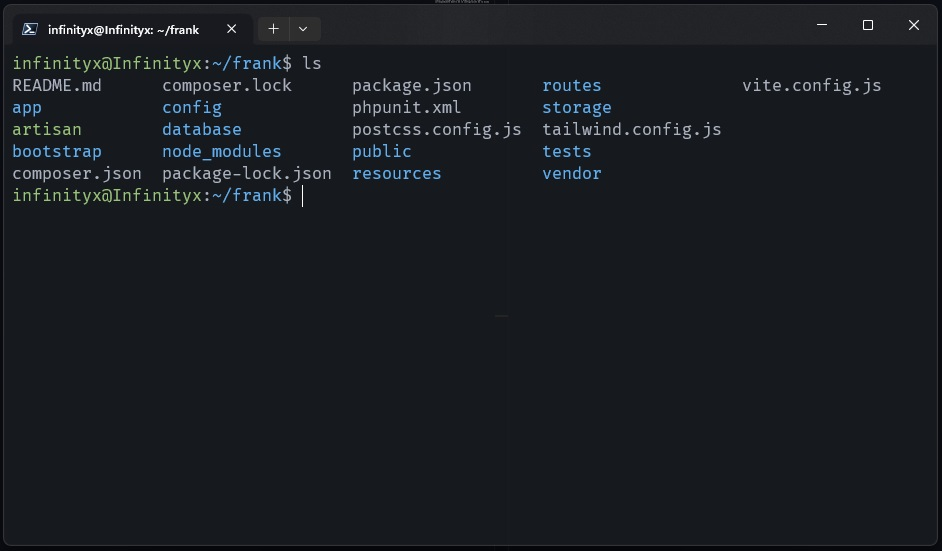
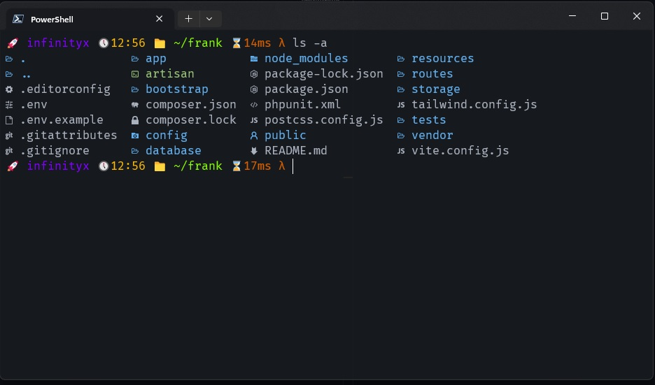
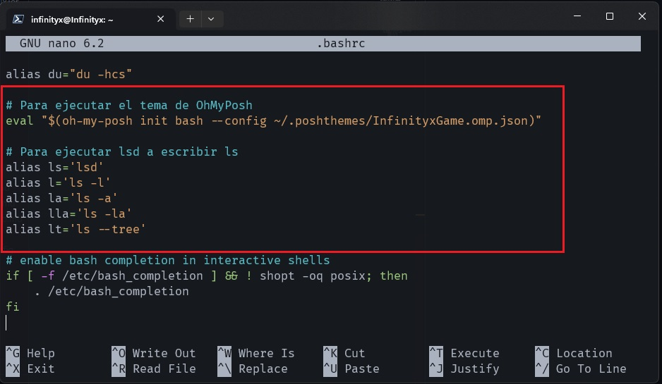
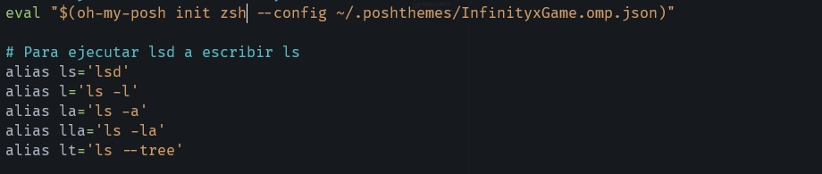

# Configuración de Terminal de Linux

### Vamos a configurar tu terminal de Linux para que deje de verse así de fea:

 

### Y se vea así de bonita:

 

### Comenzaremos instalando OhMyPosh en nuestro linux usando el siguiente comando:

```curl -s https://ohmyposh.dev/install.sh | bash -s```

Por defecto, el script se instalará en `/usr/local/bin` o la carpeta de instalación existente del ejecutable Oh My Posh. Si desea instalarlo en una ubicación diferente, puede especificarlo usando el `-d` detrás seguido de la ubicación:

```curl -s https://ohmyposh.dev/install.sh | bash -s -- -d ~/midirectorio```

### Listo ahora que lo tenemos instalado vamos a instalar otra utilidad llamada lsd

lsd nos va a permitir colorear la salida del comando ls con su respectivos iconos en nuestra terminal y así tendremos algo mucho más bonito. Para instalarlo debemos hacerlo desde el repo oficial de nuestra distribución, en mi caso que uso ubuntu es con el comendo: 

```sudo apt install lsd```

### Ahora vamos a configurar para que se ejecute lsd y OhMyPosh en nuestra terminal

Para ejecutar ambos en nuestra terminal debemos hacer lo siguiente:

#### Configuración en bash
En caso de usar la bash debemos agregar lo siguiente a al final de ~/.bashrc (podría ser ~/.profile o ~/.bash_profile dependiendo de su entorno):

1. ```eval "$(oh-my-posh init bash --config ~/.poshthemes/InfinityxGame.omp.json)"```, donde después de ```--config``` se debe escribir la ruta donde tenemos el tema, en mi caso yo cree una carpeta en el home llamada ".poshthemes" y puse el mío allí

2. También agregamos esto para al ejecutar el comando ls funcione lsd y nos coloree los archivos con sus íconos
    ```
    alias ls='lsd'
    alias l='ls -l'
    alias la='ls -a'
    alias lla='ls -la'
    alias lt='ls --tree'
          
La configuración en el bashrc debe quedar algo así:

 

3. Luego debemos ejecutar el comando  `exec bash` para que los cambios surtan efecto.

Listo si todo ha salido bien la terminal debe verse como en el ejemplo del principio.

#### Configuración en zsh

En caso de usar zsh debemos agregar lo siguiente a al final de ~/.zshrc:

1. ```eval "$(oh-my-posh init zsh --config ~/.poshthemes/InfinityxGame.omp.json)"```, donde después de ```--config``` se debe escribir la ruta donde tenemos el tema, en mi caso yo cree una carpeta en el home llamada ".poshthemes" y puse el mío allí

2. También agregamos esto para al ejecutar el comando ls funcione lsd y nos coloree los archivos con sus íconos
    ```
    alias ls='lsd'
    alias l='ls -l'
    alias la='ls -a'
    alias lla='ls -la'
    alias lt='ls --tree'
          
La configuración en el bashrc debe quedar algo así:

 

3. Luego debemos ejecutar el comando  `exec zsh` para que los cambios surtan efecto.

Listo si todo ha salido bien la terminal debe verse como en el ejemplo del principio.

### Lista de temas

Para ver la lista de temas en caso de que desee utilizar uno diferente deben ir a la web oficial en el siguiente enlace: [Temas OhMyposh](https://ohmyposh.dev/docs/themes) 

En windows con powershell ejecutando el comando `Get-PoshThemes` nos sale en consola la lista de temas pero para linux no hay ningñun comando que haga esto por lo que tienen que visitar la web oficial y revisar entre los temas disponibles.

## Esto es todo ya con esta configuración deberíamos tener lista nuestra terminal 

