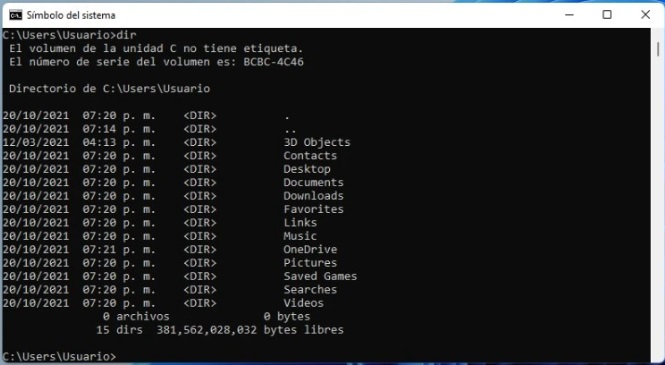
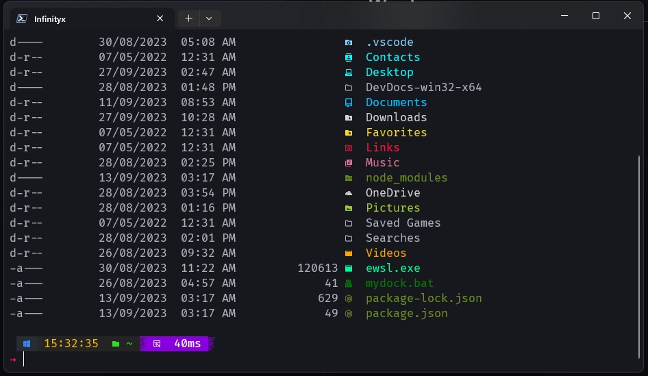

# Configuración de Terminal de Windows

### Vamos a configurar tu terminal de windows para que deje de verse así de fea:

 

Y se vea así de bonita:

 

### Lo primero que hacemos es instalar ods aplicaciones desde la Microsoft Store

#### Instalamos estas dos aplicaciones y no la abrimos

1. Windows Terminal: necesitamos esta ya que tiene más funcionalidades que la terminal que viene por defecto con Windows

2.  PowerShell: esta es la última versión de la powershell de windows, también la necesitamos 

#### Listo ahora que tenemos ambas aplicaciones procedemos a abrir la terminal instalada, para ellos en el menú inicio de windows escribimos "terminal" y la abrimos

 
