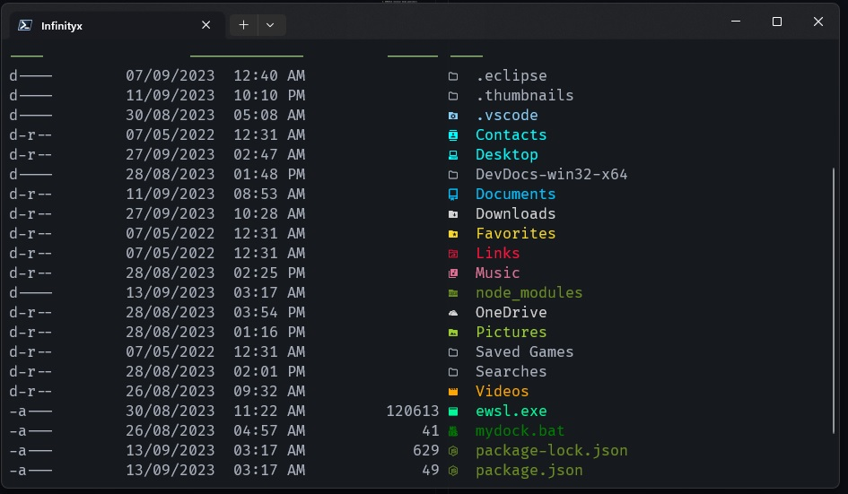

# Configuración de la terminal de windows para darle un mejor estilo

### Imagen de muestra de como quedaría nuestra terminal ya configurada

### Para la configuración vamos a necesitar tener instalado lo siguiente:

1. Windows Terminal (Instalar desde Microsoft Store)

2. PowerShell (Instalar desde Microsoft Store)

3. OhMyPosh (Instalar desde powershell)

Para instalar OhMyPosh debemos ver la documentación en su [Web oficial](http://ohmyposh.dev) donde vienen todos los pasos.

Les dejo los archivos de mi configuración al igual que el documento [WindowsTerminal.md](https://github.com/infinityxgame/Windows-Terminal-Config/blob/main/WindowsTerminal.md) donde viene detallado todo el proceso que se debe realizar, así les ahorro tiempo en leer la doc oficial e incluso vienen otros detalles que no vienen con OhMyPosh y son de utilidad.

Archivos de configuración:
1. settings.json 
2. Microsoft.PowerShell_profile.ps1

**settings.json**: contiene la configuración de la terminal donde dentro esta mi tema personalizado, es solo copiar el código del tema y pegarlo en el lugar correspondiente dentro de la configuración de la misma

**Microsoft.PowerShell_profile.ps1**: configuración predeterminada que debe debe ejecutar PowerShell al abrir la terminal 
