# Configuración de Terminal de Windows

### Vamos a configurar tu terminal de windows para que deje de verse así de fea:

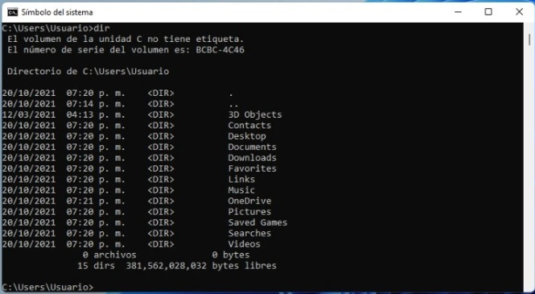 

Y se vea así de bonita:

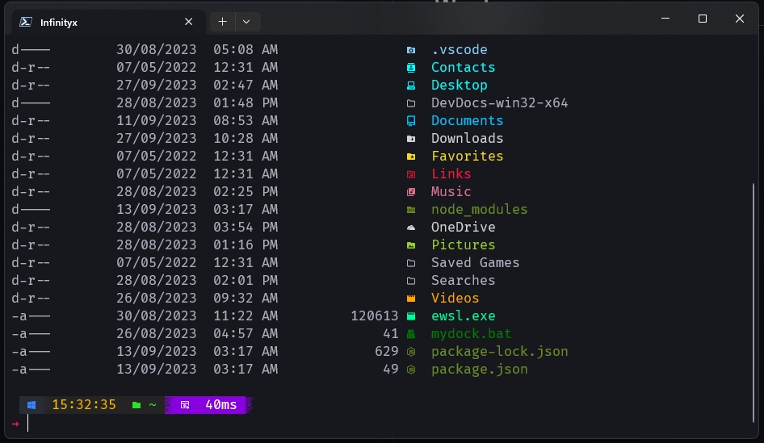 

### Lo primero que hacemos es instalar dos aplicaciones desde la Microsoft Store.

#### Instalamos estas dos aplicaciones y no la abrimos.

1. Windows Terminal: necesitamos esta ya que tiene más funcionalidades que la terminal que viene por defecto con Windows.

2.  PowerShell: esta es la última versión de la powershell de windows, también la necesitamos.

#### Tips: si no te funciona por alguna razón la Microsoft Store o simplemente deseas instalarlas usando comandos puedes hacer lo siquiente:

1. Abrimos la PowerShell de Windows
2. Para instalar Windows Terminal ponermos el siguiente comando:
    * ```winget install --id=Microsoft.WindowsTerminal -e```
3. Para instalar Windows PowerShell ponemos el siguiente comando:
    * ```winget install --id Microsoft.Powershell --source winget```


#### Listo ahora que tenemos ambas aplicaciones procedemos a abrir la terminal instalada, para ellos en el menú inicio de windows escribimos "terminal" y la abrimos.

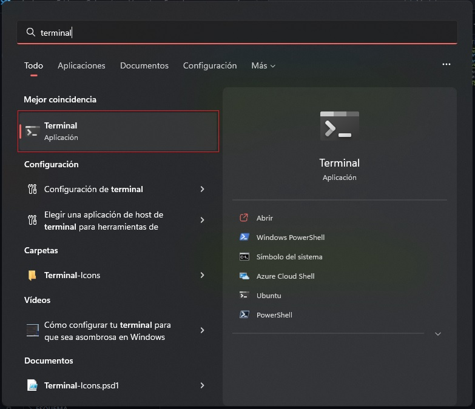 

### Ahora vamos a la configuración de la terminal para hacer unos cambios.

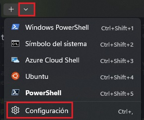 

Dentro de la configuración vamos al apartado de "Inicio" o "Startup" (en caso de tener la terminal en inglés).

1. Dentro de esto buscamos lo que dice "Perfil predeterminado" o "Default profile" y debe decir Windows PowerShell, esto lo cambiamos a PowerShell para que al abrir la terminal inicie con la nueva PowerShell de Microsoft.

2. Luego debajo donde dice "aplicación de terminal predeterminada" o "Default terminal application" debe decir Permitir que windows decida o Let Windows decide y lo cambiamos por Windows Terminal.

3. Por último damos en "guardar" o "save"

### Ahora vamos a personalizar los colores a la terminal

Para esto vamos dentro de la configuración a la izquierda donde dice "combinación de colores" o "Color scheme", dentro de esta vienen varios temas que puedes usar pero podemos agregar uno personalizado.

Para esto vamos en la configuración abajo donde dice "Abrir archivo JSON" o "Open JSON file" y te abre la configuración de la terminal, nos deja elegir con que deseamos abrir el archivo, en este caso yo uso Visual Studio Code pero tu puedes usar cualquier otro editor de código.

Tip: Si no tienes ningún editor de código usa el mismo editor de texto de windows pero no te lo recomiendo ya que vamos a realizar varios cambios y vas a tener que guardar el archivo y volver a abrirlo para seguir editando luego.

Dentro de este archivo buscamos lo que dice "schemes" sería algo así:

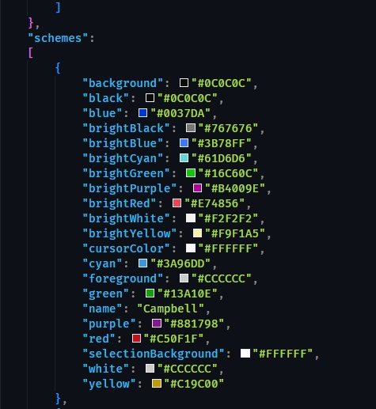

Dentro van a venir los diferentes temas que trae por defecto uno de ellos es el que viene en la foto de arriba de ejemplo, dentro de esto vamos a agregar nuestro tema personalizado, nos vamos al final de scheme y antes de "]" agregamos el tema, para esto buscamos el último tema y al final de este agregamos una "," y en la siguiente línea pegamos nuestro tema, te dejo de ejemplo el que yo utilizo:

```
        {
            "background": "#181A1F",
            "black": "#181A1F",
            "blue": "#61AFEF",
            "brightBlack": "#5C6370",
            "brightBlue": "#61AFEF",
            "brightCyan": "#56B6C2",
            "brightGreen": "#98C379",
            "brightPurple": "#C678DD",
            "brightRed": "#E06C75",
            "brightWhite": "#FFFFFF",
            "brightYellow": "#D19A66",
            "cursorColor": "#FFFFFF",
            "cyan": "#56B6C2",
            "foreground": "#ABB2BF",
            "green": "#98C379",
            "name": "InfinityxGame 2",
            "purple": "#C678DD",
            "red": "#E06C75",
            "selectionBackground": "#FFFFFF",
            "white": "#ABB2BF",
            "yellow": "#D19A66"
        },
```

Ahora vamos a la configuración de la terminal y ya debe parecer el tema agregado por tí, lo seleccionamos en mi caso se llama "InfinityxGame 2" y luego bajamos y damos clic en "Establecer como predeterminado" o "Set as default"

Ahora vamos a cambiar la barra de título para que se aplicque una capa transparente y se vea mejor, vamos a la configuración y a la izquierda en "Apariencia" o "Appearance" activamos lo que dice "Use acrylic material in the tab row" y guardamos

Procedemos a instalar un Prompt Theme llamado OhMyPosh, esta es la web oficial del mismo [OhMyPosh](http://ohmyposh.dev)

Para instalar esto tenemos que asegurarnos que tenemos winget instalado, nos vamos a la Microsoft Store y buscamos winget y debe aparecer algo llamado App Installer, esto debe venir por defecto en el sistema operativo.

Ahora escribimos lo siguiente en la terminal lo siguiente para instalar OhMyPosh: 

```winget install JanDeDobbeleer.OhMyPosh -s winget```

Esperamos a que instale y ahora vamos a instalar fuentes personalizadas para cambiar la de nuestra terminal para esto debemos abrir la terminal como administrador y escribimos el siguiente comando:

```oh-my-posh font install```

Esto nos muestra una lista de fuentes en la que buscamos la que deseemos, en mi caso voy a usar FiraCode, debemos ir bajando hasta buscar la deseada y luego presionamos eter y esta empieza a descargarse.

Para activar la fuente debemos cerrar la terminal y volverla a abrir pero esta vez como usuario, no como administrador, vamos a la configuración de la terminal y a la izquierda donde pone "Valores predeterminados" o "Default", en este apartado vamos a "Apariencia" o "Appearance" y dentro de texto en Tipo de fuente aparece la instalada por nosotros, la seleccionamos y guardamos

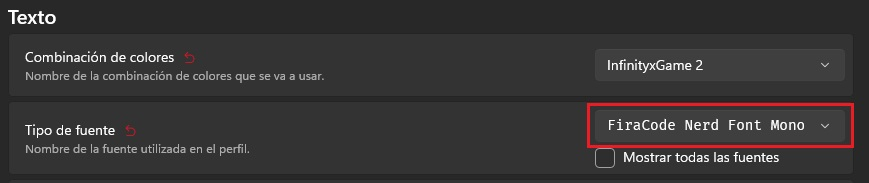

Para activar OhMyPosh debemos poner en la terminal el siguiente comando que nos va mostrar como se verá el Prompt Theme con uno por defecto que podremos cambiar después: 

```oh-my-posh init pwsh --config "$env:POSH_THEMES_PATH\jandedobbeleer.omp.json"```

y Esto nos devuelve otro comando que debemos copiar y pegar para activar el tema algo como esto:

```(@(& 'C:/Users/Infinityx/AppData/Local/Programs/oh-my-posh/bin/oh-my-posh.exe' init pwsh --config='C:\Users\Infinityx\AppData\Local\Programs\oh-my-posh\themes\jandedobbeleer.omp.json' --print) -join "`n") | Invoke-Expression```

Luego de pegar eso debería quedarnos algo así:

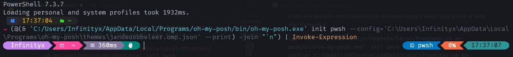

Ahora vamos a cambiar el tema, para ver todos los disponibles escribimos el comando:

```Get-PoshThemes```

Luego de dar enter aparecen todos y nos muestra con un ejemplo como se vería nuestra terminal, buscamos el tema deseado y en el nombre del tema apretamos Ctrl + Clic en él y esto nos abre en uestro editor de código predeterminado el archivo del tema, solo debemos fijarnos en el nombre del archivo que es lo que necesitamos.

Luego para aplicar el tema volvemos a escribir el mismo código que pusimos anteriormente para cargar el que tenemos pero debemos cambiar el nombre del tema al que deseemos pero no ejecutamos el comando simplemente lo copiamos, en mi caso uso el tema craver y quedaría así:

```(@(& 'C:/Users/Infinityx/AppData/Local/Programs/oh-my-posh/bin/oh-my-posh.exe' init pwsh --config='C:\Users\Infinityx\AppData\Local\Programs\oh-my-posh\themes\craver.omp.json' --print) -join "`n") | Invoke-Expression```

Ahora vamos a decirle a la terminal que debe abrir el tema seleccionado cada vez que abramos la misma, debemos el archivo configuración para eso ponemos el comando:

```code $PROFILE```

Nota: en mi caso escribo "code" delante porque uso Visual Studio Code como editor ya que me gusta más pero puedes usar notepad reemplazando "code" por "notepad" o cualquier otor que desees.

Puede que te arroje un error de que no encuentra el archivo en el path, para eso ponemos el siguiente comando:

```New-Item -Path $PROFILE -Type File -Force```

Esto nos devuelve algo así:

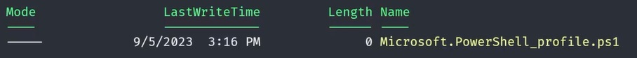

Y ahora si podemos ejecutar el comando "```code $PROFILE```". Esto nos abre el archivo de configuración y pegamos el comando que copiamos previamente del tema y guardamos, sería el siguiente: 

```(@(& 'C:/Users/Infinityx/AppData/Local/Programs/oh-my-posh/bin/oh-my-posh.exe' init pwsh --config='C:\Users\Infinityx\AppData\Local\Programs\oh-my-posh\themes\craver.omp.json' --print) -join "`n") | Invoke-Expression```

Ahora cerramos la terminal y la volvemos a abrir y verás como ya tiene el tema seleccionado por tí, vamos a agregarle íconos para que se vea mejor nuestra terminal ya que si ejecutamos el comando "ls" nos muestra los archivos del directorio pero no es tan bonito.

Para instalar los íconos debemos poner le siguiente comando en la terminal:

```Install-Module -Name Terminal-Icons -Repository PSGallery```

Nos muestra un mensaje de alerta de que no confia en el repositorio de PSGallery, debemos escribir la letra A en mayúsculas y presionar enter para que acepte todos los paquetes de dicho repositorio, es una instalación bastante rápida, pero debemos activarlos ya que no se muestran por si solos. 

Para activarlos debemos copiar un comando dentro del perfíl de configuración, escribimos "code $PROFILE" o con el ditor que deseen y en una nueva línea agregamos lo siguiente:

```Import-Module Terminal-Icons```

Guardamos, y al volver a abrir nuestra terminal tenemos los íconos aplicados, podemos verificarlo con el comando "ls" y vemos que nos muestra algo como esto:

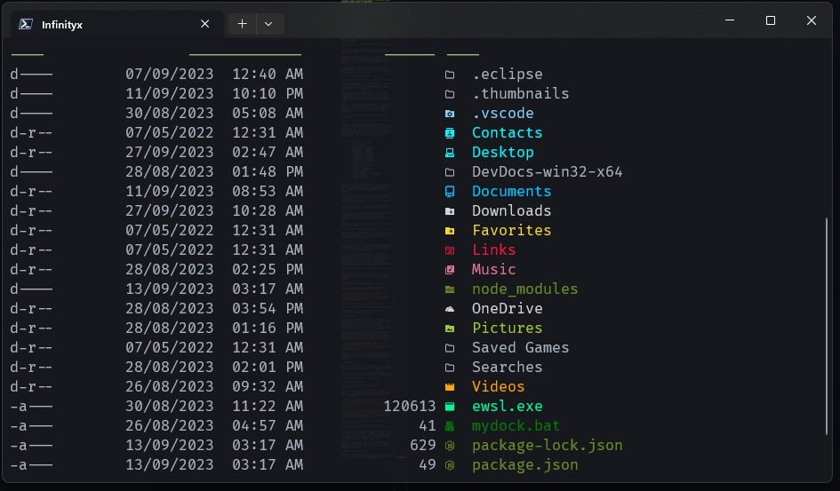

Como último PowerShell tien un mçodulo llamado "PSReadLine" que nos ayuda recomendándonos comandos a medida que escribimos en la terminal y si queremos el comando debemos presionar la flecha derecha y nos autocompleta con el mismo.

Este módulo tiene una opción que nos sugiere a medida que escribimos algo todo el historial de comandos que hemos ejecutado que contiene parte de lo escrito y podemos desplazarnos y ejecutar alguno, algo como esto:

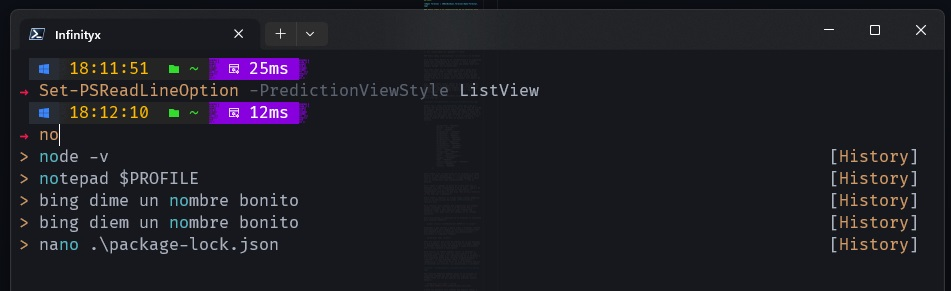

Yo no lo dejo activo ya que no me gusta pero si tú deseas dejarlo activo solo debes poner lo siguiente en el PROFILE: 

1. Ejecutamos el comando ```code $PROFILE```

2. En una nueva línea pegamos lo siguiente:
    * ```Set-PSReadLineOption -PredictionViewStyle ListView```

3. Guardamos el archivo de configuración y listo cerramos y volvemos a abrir nuestra terminal y debería funcionar correctamente.

### Como configuración adicional yo cambio ciertas cosas

En los ejemplos de arriba siempre puse como tema craver que viene por defecto al instalar OhMyPosh pero para mi use uno personalizado tomando como referencia el tema half-life.omp.json que viene dentro del programa y le realicé cambios a mi gusto, dicho tema lo dejé en la carpeta Config del repositorio por si les interesa y les gusta como queda.

Mi tema de OhMyPosh quedaría así:
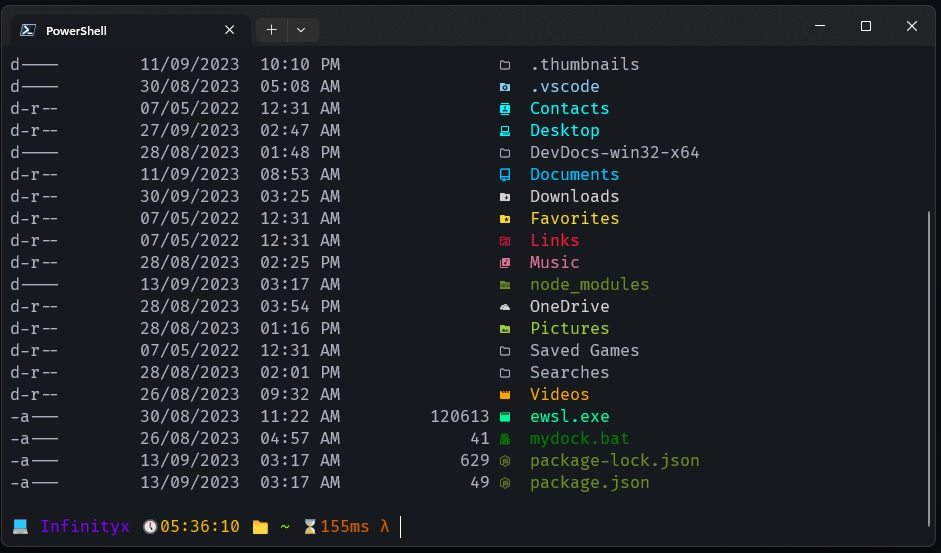

también personalmente me gusta la terminal con algo de transparencia, para esto voy a la configuración de la terminal y en Valores predeterminados voy al apartado de apariencia, busco donde dice transparencia y en opacidad del fondo lo dejo al 90% y guardo el cambio.

Esto depende ya del gusto de cada cual, podemos agregar opacidad al fondo al igual que habilitar el materia acrílico para que se vea con blur, solo deben probar como les gusta más.

### Listo ya estaría configurada la termianl de forma que se ve mucho más bonita y agradable de cara al usuario.

