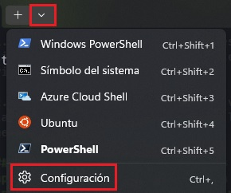
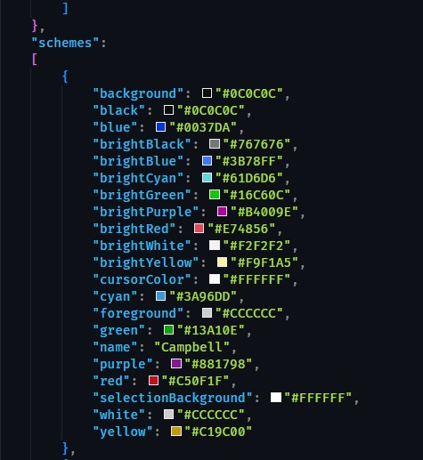
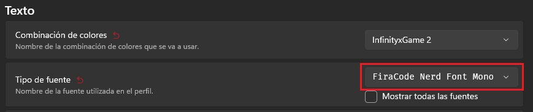

# Configuración de Terminal CMD de Windows

### Lo primero que necesitamos tener instalado 3 aplicaciones dos de ellas 1 desde la Microsoft Store y las otras dos las buscamos luego

#### Instalamos esta aplicación desde la Microsoft Store

1. Windows Terminal: necesitamos esta ya que tiene más funcionalidades que la terminal que viene por defecto con Windows.

#### Tip: si no quieres instalarla desde la Microsoft Store puedes hacerlo usando este comando:

1. Abrimos la PowerShell de Windows
2. Para instalar Windows Terminal ponermos el siguiente comando:
    * ```winget install --id=Microsoft.WindowsTerminal -e```

#### OJO👁️ Para la instalación mediante este comando asegúrate de tener la última versión de winget ya que en caso de no tenerlo actualizado les saltará error, este lo puede actualizar desde la propia tienda

#### Listo ahora procedemos a abrir la terminal instalada, para ellos en el menú inicio de windows escribimos "terminal" y la abrimos.

 

### Ahora vamos a la configuración de la terminal para hacer unos cambios. (Si ya la tienes configurada no es necesario que hagas este paso)

 

Dentro de la configuración vamos al apartado de "Inicio" o "Startup" (en caso de tener la terminal en inglés).

1. Dentro de esto buscamos lo que dice "Perfil predeterminado" o "Default profile" y debe decir Windows PowerShell, esto lo cambiamos a PowerShell para que al abrir la terminal inicie con la nueva PowerShell de Microsoft.

2. Luego debajo donde dice "aplicación de terminal predeterminada" o "Default terminal application" debe decir Permitir que windows decida o Let Windows decide y lo cambiamos por Windows Terminal.

3. Por último damos en "guardar" o "save"

### Ahora vamos a personalizar los colores a la terminal

Para esto vamos dentro de la configuración a la izquierda donde dice "combinación de colores" o "Color scheme", dentro de esta vienen varios temas que puedes usar pero podemos agregar uno personalizado.

Para esto vamos en la configuración abajo donde dice "Abrir archivo JSON" o "Open JSON file" y te abre la configuración de la terminal, nos deja elegir con que deseamos abrir el archivo, en este caso yo uso Visual Studio Code pero tu puedes usar cualquier otro editor de código.

Tip: Si no tienes ningún editor de código usa el mismo editor de texto de windows pero no te lo recomiendo ya que vamos a realizar varios cambios y vas a tener que guardar el archivo y volver a abrirlo para seguir editando luego.

Dentro de este archivo buscamos lo que dice "schemes" sería algo así:



Dentro van a venir los diferentes temas que trae por defecto uno de ellos es el que viene en la foto de arriba de ejemplo, dentro de esto vamos a agregar nuestro tema personalizado, nos vamos al final de scheme y antes de "]" agregamos el tema, para esto buscamos el último tema y al final de este agregamos una "," y en la siguiente línea pegamos nuestro tema, te dejo de ejemplo el que yo utilizo:

```
        {
            "background": "#181A1F",
            "black": "#181A1F",
            "blue": "#61AFEF",
            "brightBlack": "#5C6370",
            "brightBlue": "#61AFEF",
            "brightCyan": "#56B6C2",
            "brightGreen": "#98C379",
            "brightPurple": "#C678DD",
            "brightRed": "#E06C75",
            "brightWhite": "#FFFFFF",
            "brightYellow": "#D19A66",
            "cursorColor": "#FFFFFF",
            "cyan": "#56B6C2",
            "foreground": "#ABB2BF",
            "green": "#98C379",
            "name": "InfinityxGame 2",
            "purple": "#C678DD",
            "red": "#E06C75",
            "selectionBackground": "#FFFFFF",
            "white": "#ABB2BF",
            "yellow": "#D19A66"
        },
```

hora vamos a la configuración de la terminal y ya debe parecer el tema agregado por tí, lo seleccionamos en mi caso se llama "InfinityxGame 2" y luego bajamos y damos clic en "Establecer como predeterminado" o "Set as default"

Ahora vamos a cambiar la barra de título para que se aplique una capa transparente y se vea mejor, vamos a la configuración y a la izquierda en "Apariencia" o "Appearance" activamos lo que dice "Use acrylic material in the tab row" y guardamos

Procedemos a instalar un Prompt Theme llamado OhMyPosh, esta es la web oficial del mismo [OhMyPosh](http://ohmyposh.dev)

Para instalar esto tenemos que asegurarnos que tenemos winget instalado, nos vamos a la Microsoft Store y buscamos winget y debe aparecer algo llamado App Installer, esto debe venir por defecto en el sistema operativo.

Ahora escribimos lo siguiente en la terminal lo siguiente para instalar OhMyPosh: 

```winget install JanDeDobbeleer.OhMyPosh -s winget```

Esperamos a que instale y ahora vamos a instalar fuentes personalizadas para cambiar la de nuestra terminal para esto debemos abrir la terminal como administrador y escribimos el siguiente comando:

```oh-my-posh font install```

Esto nos muestra una lista de fuentes en la que buscamos la que deseemos, en mi caso voy a usar FiraCode, debemos ir bajando hasta buscar la deseada y luego presionamos enter y esta empieza a descargarse.

Para activar la fuente debemos cerrar la terminal y volverla a abrir pero esta vez como usuario, no como administrador, vamos a la configuración de la terminal y a la izquierda donde pone "Valores predeterminados" o "Default", en este apartado vamos a "Apariencia" o "Appearance" y dentro de texto en Tipo de fuente aparece la instalada por nosotros, la seleccionamos y guardamos



Ahora procedemos a instalar el tercer programa ya que tenemos instalado la Terminal y oh-my-posh

### Instalando Clink

Clink: Clink combina el shell cmd.exe nativo de Windows con las potentes funciones de edición de línea de comandos de la biblioteca GNU Readline, que proporciona capacidades completas de finalización, historial y edición de líneas. Readline es mejor conocido por su uso en el shell Bash de Unix, el shell estándar para Mac OS X y muchas distribuciones de Linux.

Clink nos ofrece diferentes ventajas como son:

1. Sugerencias
2. Autocompletado
3. Mejoras en la edición de la línea de comandos
4. Posibilidad de instalar oh-my-posh junto a nuestro tema para que qe vea parecida a nuestra PowerShell

Para instalar Clink vamos al siguiente enlace y descargamos la última release que este disponible [Descargar Clink](https://github.com/chrisant996/clink/releases)

1. Entramos al enlace y bajamos la última release disponible, deben fijarse que en su nombre diga setup y sea un ejecutable (.exe)
2. Cuando termine la descarga simplemente lo instalamos y al abrir nuestra CMD nos aparece por defecto pero se ve feo y básico por lo que debemos proceder a configurar nuestro tema de oh-my-posh

#### COnfigurando oh-my-posh en Clink

Para configurar oh-my-posh junto a clink debemos primeramente buscar la carpeta de instalación del programa mediante el siguiente comando: 

```
    clink info

```
Y esto te devuelve como resultado lo que se aprecia en la siguiente imagen: 


En la imagen nos fijamos en el recuadro rojo, esa es la dirección donde se encuentra instalado el programa

Ahora debemos ir a dicha ruta y crear un archivo con el siguiente nombre: 

``` oh-my-posh.lua ```

Y dentro de él debemos escribir lo siguiente:

``` load(io.popen('oh-my-posh init cmd --config C:/Users/Infinityx/AppData/Local/Programs/oh-my-posh/themes/InfinityxGame.omp.json'):read("*a"))() ```

Reemplazando la ruta C:/Users/... por la ruta donde se encuentre el archivo de tu tema o el tema que deseas habilitar, guardamos el archivo y al abrir nuevamente el CMD ya debe encontrarse aplicado nuestro tema como en la siguiente imagen: 


